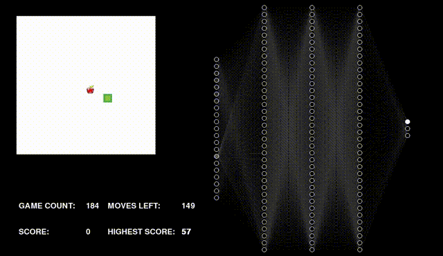
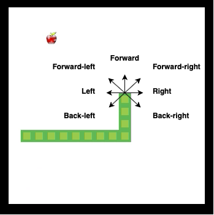
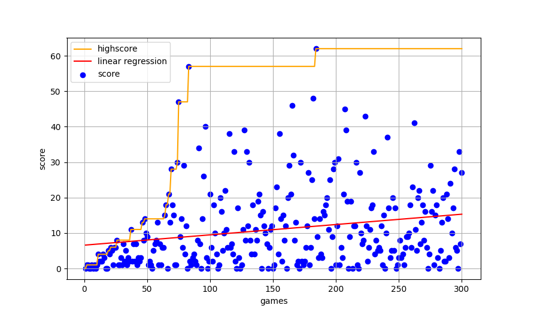

# Training an AI bot to play Snake

The goal of this project was to train an AI bot to play Snake. The bot didn't get any information about the rules of the game - it had to guess them by itself. All information it got was *snake vision* and information about reward or penalty. The game and the bot were written in *Python*.

[Watch the training process on YouTube](https://www.youtube.com/watch?v=ozFDavKIvpk)

<a href="https://www.youtube.com/watch?v=ozFDavKIvpk">
  <p align="center">
    
  </p>
</a>

----

# Algorithm

I implemented a *Deep Reinforcement Learning* algorithm - *Deep Q Neural Network*.


## Input - Snake vision

The neural network input is a 21 element vector. It represents *snake vision*. 
There are three types of objects: wall, snake body and fruit.
For each object type, the vector contains 7 numbers that represent distances to the nearest object in every direction.
|   Object  | Object |    Object    |  Object |     Object    | Object |   Object   |
|:---------:|:------:|:------------:|:-------:|:-------------:|:------:|:----------:|
| Back-left |  Left  | Forward-left | Forward | Forward-right |  Right | Back-right |


<p align="center">
  
</p>

The distance in the vector is a floating-point number, with a maximum value of 1 and a minimum of 0. It is calculated with the following equation:
```math
1 / distance
```

The value of 1 means that the object is very near and the value of 0 means it is very far away.

## Output

There are 3 outputs from the neural network - possible snake moves. Snake can go either **forward**, **left** or **right**.

## Moves limit

I have introduced a limit of moves to prevent the snake from spinning around. After eating fruit the counter of remaining moves is reset. Also, the larger the snake, the more movements it has.

## Rewards

* eating a fruit - reward
* game end - penalty


## Experience replay

There is a limited *replay buffer* that stores the information about last moves:
* current state,
* decision,
* reward,
* next state,
* is game ended.

After each game, some **random** tuples are being taken from this buffer and they are used to train the neural network. It helps to avoid forgetting previous experiences and helps to reduce correlations between experiences (if tuples are being taken from buffer randomly).

## Random moves

During training, random decisions are occasionally taken to allow the snake to better explore space in search of the best global solution. This happens according to the algorithm of simulated annealing. In the first games, the probability of choosing a random move is the highest and decreases with each subsequent game.

## Results

<p align="center">
  
</p>

## Conclusions/Notes

* The initial positions of the snake and fruit **during training** are **fixed**. Finding fruit faster in the early stages of the game resulted in faster learning due to early recognition of the reward.
* Adding *moves left* counter and decreasing the value of *learning rate* in *Adam optimizer* resulted in less spinning around of snake.
* Adding random moves in early stages resulted in much faster learning and helped to achieve much higher results.

# Code
## Requirements

* *Python 3*

## Installation

```bash
git clone https://github.com/pawelkami/AI-Snake
cd AI-Snake/
python3 -m venv venv
source venv/bin/activate
pip3 install -r requirements.txt
```

## Launching program

```bash
usage: snakeGame.py [-h] [--speed SPEED] [--count COUNT] [--ai] [--train]

optional arguments:
  -h, --help     show this help message and exit
  --speed SPEED  Speed of game. 0 is the fastest. Default: 100
  --count COUNT  Game count to play. Default: 100
  --ai           AI controlls snake
  --train        Train AI model
```

### Examples

1. Playing the game with your keyboard (keyboard: left and right arrow keys).

```bash
python3 snakeGame.py
```

2. Training the model (speed should be 0 for the fastest training).
```bash
python3 snakeGame.py --ai --train --speed 0
```

3. Running the game with the trained model.
```bash
python3 snakeGame.py --ai --speed 0
```